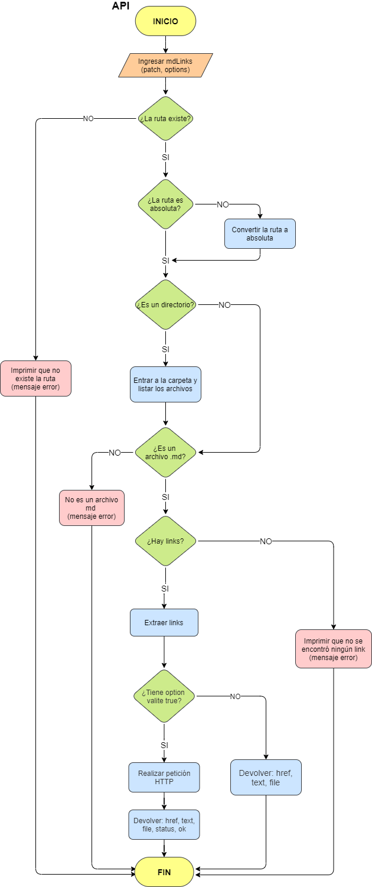
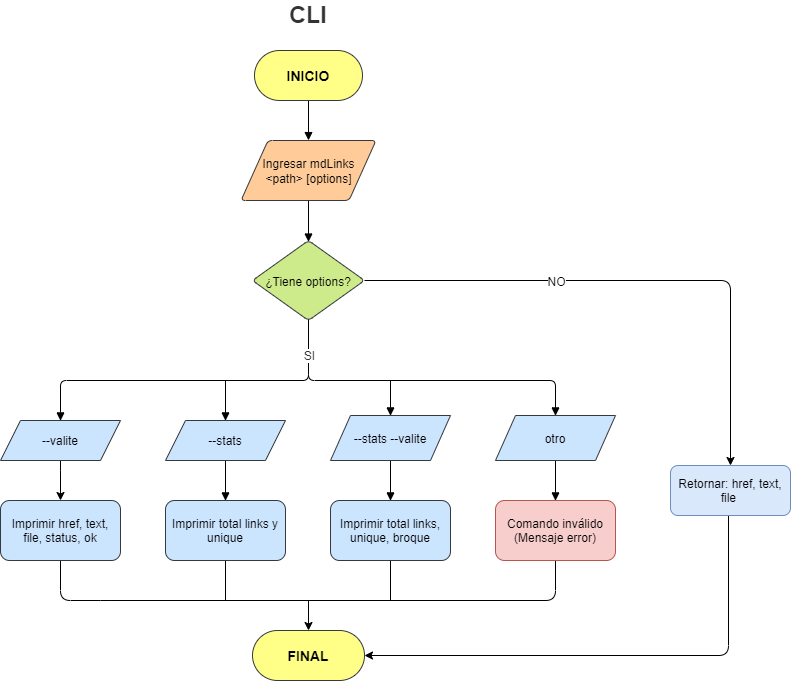
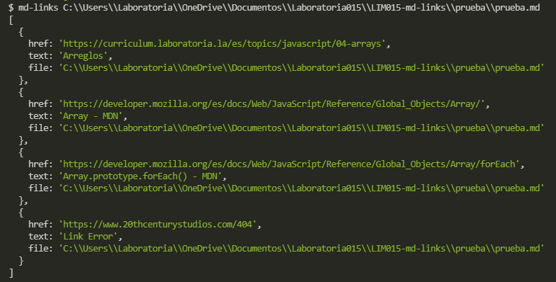
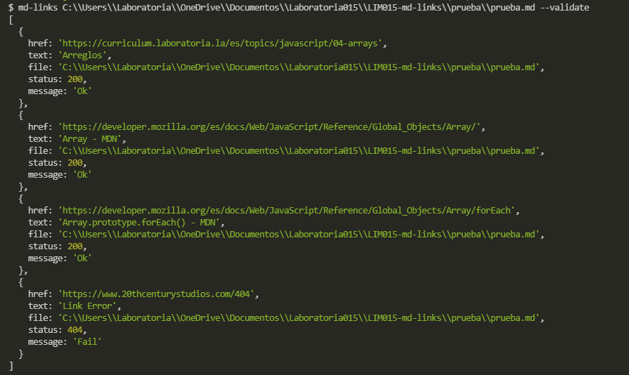
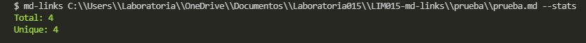
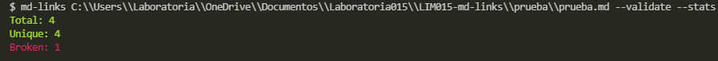
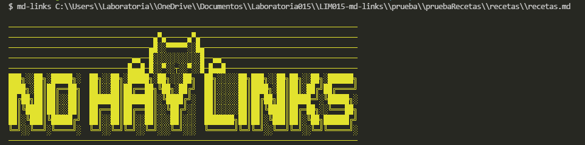
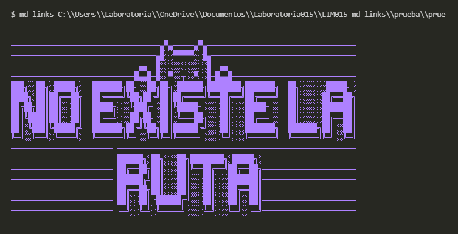
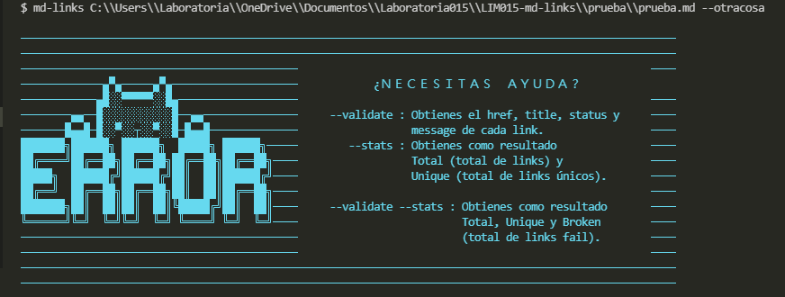

# Markdown Links

Markdown es un lenguaje de marcado
ligero muy popular entre developers. Es usado en muchísimas plataformas que
manejan texto plano (GitHub, foros, blogs, ...), y es muy común
encontrar varios archivos en ese formato en cualquier tipo de repositorio
(empezando por el tradicional `README.md`).

Estos archivos `Markdown` normalmente contienen _links_ (vínculos/ligas) que
muchas veces están rotos o ya no son válidos y eso perjudica mucho el valor de
la información que se quiere compartir.

## 2. Diagrama de Flujo

Para poder realizar esta librería, se realizaron 2 diagramas de flujo para cada tipo.

### 1) API



### 2) CLI (Command Line Interface - Interfaz de Línea de Comando)



## 3. Instalación

Por npm:

`$ npm i md-links-lim015`

Por repo de github:

`npm i --global GinaFlores/LIM015-md-links`

## 4. Guía de Uso

### API

Para acceder a `mdLinks`, debemos importarla con

`const mdLinks = require('md-links-lim015')`

Esta es una promesa que recibe dos parámetros: `path` (ruta absoluta o relativa) y `option`, retornando un array de objetos por cada link encontrado con sus propiedades (href, text y file).

#### Ejemplos de uso:
```js
const mdLinks = require("md-links");

mdLinks("./some/example.md")
  .then((links) => {
    // => [{ href, text, file }, ...]
  })
  .catch(console.error);

mdLinks("./some/example.md", { validate: true })
  .then((links) => {
    // => [{ href, text, file, status, ok }, ...]
  })
  .catch(console.error);

mdLinks("./some/dir")
  .then((links) => {
    // => [{ href, text, file }, ...]
  })
  .catch(console.error);
```

### CLI

En la línea de interfaz de comando (CLI), se coloca lo siguiente:

`md-links <path-to-file> [options]`

- Si pasamos la ruta sin opciones, retornará el href, text, file de cada uno de los links encontrados.



- Si pasamos la opción `--validate`, retornará el href, texto y file de los links encontrados, además del status (200, 404) y su mensaje respectivo (ok o fail).



- Si pasamos la opción `--stats`, el resultado serán el total de links encontrados y los links únicos (sin repetir).



- Si pasamos la opción (`--stats --validate`) o (`--validate --stats`) arrojará la cantidad total de links, así como de los links sin repetir y de los que estén rotos



- Si pasamos la ruta que no contiene links, la consola arrojará el mensaje siguiente:



- Si pasamos la ruta mal escrita, la consola arrojará el mensaje siguiente:



- Si pasamos la ruta bien escrita con alguna opción no válida, la consola arrojará lo siguiente:



## 5. Autora
Gina Gonzales Flores - Lim015 Laboratoria